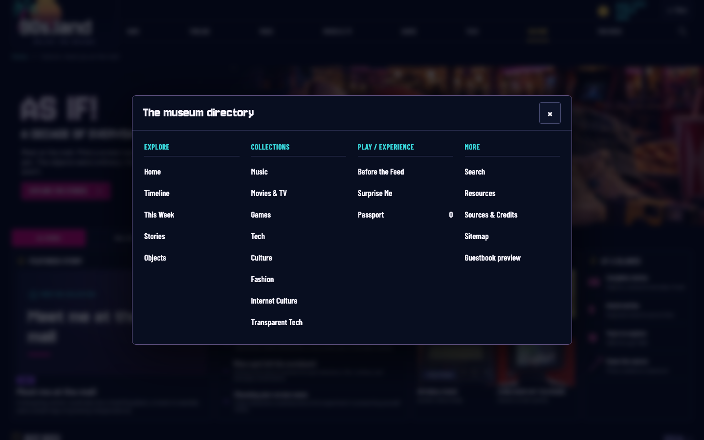
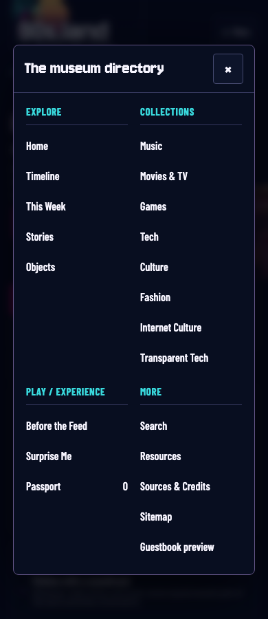

# Public v1.0 launch — Phase 1 completion report

Verified September 30, 2026. Starting revision: `dcc85206579240b51e43f54a0647df4fefeb79b7`.

Phase 1 functional acceptance passed. The approved editorial design, imagery,
typography, colors, content catalogs, source records, and historical URLs are
preserved. Phase 2 and Phase 3 have not begun.

## Findings and changes

### Timeline and weekly empty states

The reported false-empty-state problem was already absent from the current
checkout and the live June 1996 timeline. Its existing renderer calculates event
counts and empty-state visibility from the same filtered collection. This sprint
verified that behavior exhaustively and added regression protection:

- All 10 years, all 12 months, all 7 category options, all 8 region options,
  and grid/list/calendar views at 390px and 1440px: **40,320 combinations**.
- Every historical Monday–Sunday week in the decade: **522 weeks at two widths**,
  or **1,044 weekly checks**.
- Counts, filtered cards, calendar links, hidden attributes, and actual computed
  empty-state visibility must agree. Pagination is verified separately, including
  a growing month with more than 12 events.
- Static month empty states are checked against the authoritative event catalog.
- Genuine empty days and weeks now use concise visitor-facing wording. A daily
  empty message appears only inside a day with no entries.

### Navigation

- Added a full museum directory available from Menu on desktop and mobile.
- Grouped destinations into Explore, Collections, Play / Experience, and More.
- Included the specialist collections, Objects, Stories, Search, Before the Feed,
  Surprise Me, Passport, Resources, Credits, Sitemap, and the guestbook preview.
- Retained the eight primary navigation destinations and existing Search icon.
- Reused the existing native dialog system for keyboard focus containment,
  Escape, close buttons, backdrop dismissal, and return focus.
- Passport can open from the directory and return focus to Menu, including after
  its reset/cancel flow.
- With JavaScript disabled or enhancements unavailable, primary links and a
  Museum directory link to Sitemap remain available.
- Removed the obsolete mobile dropdown controller and its unused `is-open` CSS
  rule rather than retaining two menu behaviors.

### Passport, tour, and Surprise Me

- Culture visits now persist and count toward Room Hopper.
- Tour completion persists through reloads and revisiting earlier stops; a
  completed tour no longer becomes an unfinished resume entry.
- Malformed percent-encoded tour anchors recover without disabling page
  enhancements. Back/forward and fragment changes select the proper stop.
- Resetting Passport also clears the completed tour's disabled finish control.
- Surprise Me handles a failed catalog request with an accessible error message,
  retry button, and object-collection link. Retry fetches again successfully.
- The Surprise Me dialog keeps an accessible name while loading and on failure.
- Existing recent-choice avoidance and destination/stamp behavior passed QA.

### Copy and presentation

- Removed implementation details from sharing-art credits while retaining explicit
  AI-art disclosure, creators, dates, font licenses, and photo provenance.
- Simplified the game-shelf introduction and derived its displayed pick count from
  the collection instead of hard-coding it.
- Checked all 475 public routes for development-note phrases, TODO/FIXME, lorem,
  placeholder copy, and accidental prompt language: **zero matches**.
- Verified one modern main composition, header, footer, and primary heading per
  page; legacy reading rooms, preserved-layout wrappers, window chrome, and old
  page shells are absent. Most legacy removal had already shipped in the starting
  revision; this sprint preserves that result.
- No events, stories, objects, resources, source links, photographs, or historical
  fragment identities were removed. Frozen migration fixtures remain unchanged.

## Files changed

| Area | Authoritative files |
|---|---|
| Shared shell and directory | `tools/editorial.py`, `tools/render_site.py`, `editorial.css`, `js/navigation.js` |
| Passport and tour fixes | `js/passport.js`, `js/tour.js` |
| Random-memory recovery | `js/surprise.js`, `tools/render_site.py` |
| Visitor copy and enhancement versions | `tools/archive_pages.py`, `tools/hub_pages.py`, `js/archive.js`, `js/app.js` |
| New regression coverage | `tests/launch-phase1.spec.mjs`, `tests/test_launch_phase1.py` |
| Existing QA adapted to directory and copy | `tests/site.spec.mjs`, `tests/release.spec.mjs`, `tests/archive.spec.mjs` |
| Report and visual evidence | This report; `reports/launch-phase1/directory-1440.png`, `reports/launch-phase1/directory-390.png` |

Regenerated **476 public HTML files**: every catalog route plus `404.html`.
The global shell/recovery markup and asset version change accounts for the broad
generated diff. Authoritative data catalogs and artwork are unchanged.

## Routes and responsive coverage

Browser QA exercised every one of the **475 catalog routes** at 390×844,
768×1024, 1280×800, and 1440×900. Representative page families and the directory
also passed narrow-phone review at 320px.

Coverage includes Home, Timeline, every year 1990–1999, This Week, all eight
collection pages (including Transparent Tech), Stories and all story details,
Events and all event details, Objects and all object details, Before the Feed,
Surprise Me, Search, Resources, Credits, Sitemap, guestbook preview, and 404.
Passport, the full directory, filters, pagination, historical fragments,
no-JavaScript fallbacks, all six tour stops, and recovery flows were tested.

Every catalog route also passed a browser runtime/image sweep: no page errors,
console errors, failing HTTP responses, or undecodable page images. Visual review
included the live baseline, local desktop and phone directory, mobile filtered
calendar/agenda, tablet Music, and laptop This Week.

## Verification results

| Check | Result |
|---|---|
| Complete Playwright suite against the packaged release | **137 passed** |
| Python unit tests | **39 passed** |
| Civil-date tests | **6 passed** |
| Static site/link audit | **475 routes, 26,749 internal links, 1,599 fragment links; zero errors** |
| Packaged release HTTP audit | **475/475 routes passed; zero errors** |
| Private-file HTTP probes and identity/gzip responses | Passed |
| Generated-output freshness | Passed |
| Asset integrity | **103 files; zero stale assets** |
| Media/intrinsic-dimension validation | Passed |
| Frozen content extraction, catalog preservation, coverage report | Passed |
| Editorial publication/source/media gate | Passed |
| Whitespace/diff check | Passed |

The browser suite includes axe checks across major page families and the opened
directory at all five representative widths. No new application warnings were
introduced. The existing macOS command-line tool license problem was avoided by
using the installed bundled Python/Node runtimes and working Xcode Git executable.

Public package: `dist/release/public/`, **619 runtime files**.
Content digest: `3c38e659c59624b30f7f85a8407e642a4655d71599d6430da88a62beae2745e4`.
Local HTTP evidence is saved in ignored `dist/launch-phase1-http.json`.

## Intentionally deferred

**Phase 2:** cultural coverage balance, defining moments per year, richer year
hierarchy, homepage year selector, deeper editorial humanization, search
architecture, and contextual story/object/event links. The existing catalog has
384 events: 345 Movies & TV, 12 Tech, 11 Culture, 8 Music, 7 Games, and 1 World
news. Movies & TV therefore represents approximately 90% of dated events; this
content imbalance remains visible and belongs in the curation sprint. Existing
good sourced film records were retained.

**Phase 3:** content-specific social previews, SEO refinements, richer weekly and
Surprise Me selection, performance measurement, broader accessibility polish,
and the final external-link crawl. The static audit retains 728 external link
references; it does not certify their current HTTP availability.

No known Phase 1 functional blocker remains under the tested conditions. Tests
use Chromium; they do not constitute separate Safari/Firefox certification.

## Git and deployment

This sprint targets the existing GitHub `main` branch. The commit/hash and verified
push result are recorded in the completion message so this report can be part of
that same commit. GitHub main was checked against the starting revision before
publication.

The public release is built and validated locally. No VPS, hosting, DNS, or
production publication was performed. The repository's existing release procedure
requires a separately confirmed deployment target and serving configuration.

## Visual evidence

